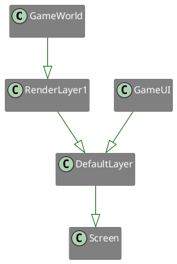
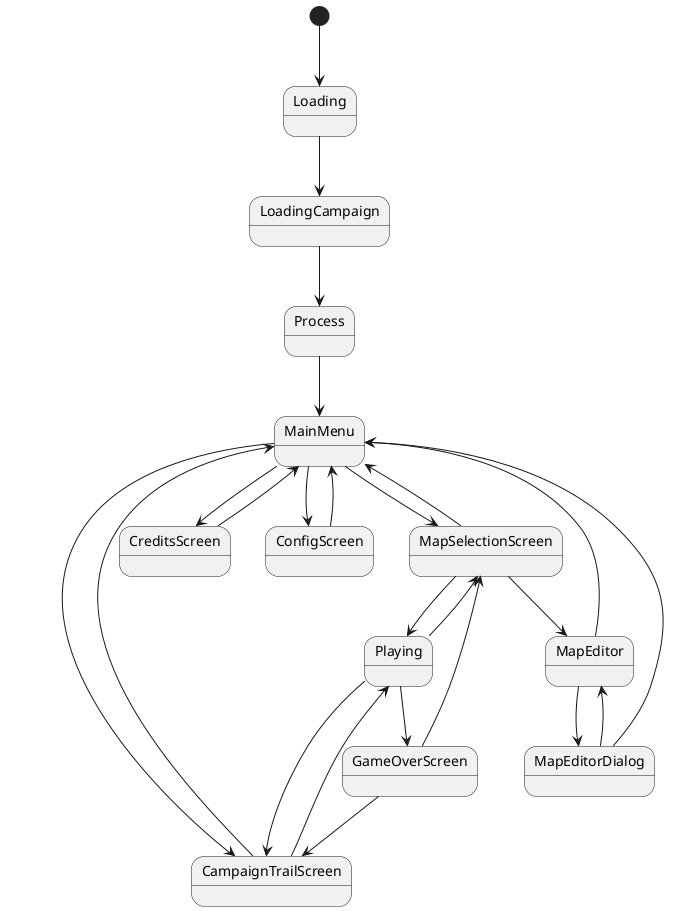

# Exodus

A Re-Implementation of the
game [Space Exodus](https://web.archive.org/web/20010609173820/http://www.davidsansome.co.uk/pages/psion/exodus/index.htm)
, originally written by [David Sansome](http://www.davidsansome.com/) for Psion EPOC-based handheld computers.
This game is a stand-alone cross-platform project implemented in [Rust](https://www.rust-lang.org/) using
the [Bevy](https://bevyengine.org/) engine.

The original EPOC game can be downloaded under the following links:

| Psion Revo                                                                     | Psion 5mx                                                         |
|--------------------------------------------------------------------------------|-------------------------------------------------------------------|
| [Download](https://archive.org/details/tucows_55899_Space_Exodus_Revo_version) | [Download](https://archive.org/details/tucows_45515_Space_Exodus) |
| [Old Version 2.01](http://www.psion-user-club.at/d_game3.html)                 |                                                                   |

## Compilation Instructions

To compile the game, you need to set up a [Rust Toolchain](https://www.rust-lang.org/learn/get-started) on your
computer, running an operating system supported by
the [Bevy Game Engine](https://bevy-cheatbook.github.io/platforms.html).

First, you need to update your Rust version to the latest stable release using `rustup`, by
typing `rustup update stable`.
Then, you can build the game by running `cargo build` and `cargo run` in the cloned repository path.

As soon as the game is ready for a first release, I will provide pre-compiled artifacts here which can be run
effortlessly without installing any additional software.

## How to play

The game is currently in a "Prototype" state, which means that the basic game functionality is working and can already
be tested.
There are currently plenty of graphics glitches and the sprites will probably change before the first release of the
game is stable.
Feel free to test the game yourself, but do not expect a satisfying experience.
You can already try out the campaign mode, although it will get more levels in the future.
Just click the Campaign button in the main menu and navigate through the campaign trail using the arrow keys.
There is a playable tutorial in the campaign trail.

### Controls

| Key                    | Use                           |
|------------------------|-------------------------------|
| Arrow Left/Arrow Right | Move the player left or right |
| Arrow Up               | Jump up or ascend on a ladder |
| Arrow Down             | Descend on a ladder           |
| Q/W                    | Jump two tiles left or right  |
| Esc                    | Return to the menu screen     |

# Development Documentation

## Render Layers

The game is rendered into an intermediate render layer, which is then rendered onto a texture, which is shown on the
main layer.
This is a workaround for Bevy bug [#4748](https://github.com/bevyengine/bevy/issues/4748) - Previous workarounds turned
out to be extremely platform-dependent and this approach should work independently and without much overhead.



Take note that everything that needs to be drawn into the game world must be rendered onto that layer.

## Campaign Mode

The campaign trail is saved in a [TGF](https://en.wikipedia.org/wiki/Trivial_Graph_Format) file with the following
syntax:

```text
<ID> [File Name] <X Coordinate> <Y Coordinate>
<ID> [File Name] <X Coordinate> <Y Coordinate>
#
<ID> <ID> [Edge Name]
<ID> <ID> [Edge Name]
```

Each file name describes a path relative to the `campaign` folder in the program directory, e.g. `tutorial_jumping.exm`.
Each ID must be a unique (not necessarily consecutive) non-negative integer.
The coordinates may be negative and describe the position of each node with positive X to the right and positive Y to
the top.
If the file name is omitted and only coordinates are given, an empty node is added with the sole purpose of connecting
other nodes.

In the lines following the single hash (#), all edges of the campaign trail must be described.

##### Editing or adding Campaign Mode Maps using the built-in Map Editor

To edit campaign mode maps, you can create a link of the assets/maps folder inside your exodus user maps folder,
e.g. by typing `ln -s /absolute/path/to/exodus/assets/maps /home/${USER}/.local/share/libexodus/maps/campaign`.
Exodus will automatically follow the symlink when new maps are searched.
To save a map as campaign map, simply prefix the map name with `campaign/`.

When creating

### Limitations

Depending on the implementation of the game, adjacent nodes in the campaign trail may or may not be connected to each
other.
Therefore, we throw an error when two adjacent nodes are NOT connected (else, this will lead to possible UI glitches).

Furthermore, there cannot be any orphaned partial graphs that are unreachable from the start (0,0).
The start node will always be at (0,0) - a node at that position will automatically be a start node.

The start node must be given, usually as an empty node.

All edges are bidirectional.
When connecting two nodes, exactly one of the coordinates must match, i.e., a connection must always add a straight
horizontal or vertical edge.
There cannot be any diagonal edges.
This limitation is intentional to make sure that campaign trails made out of squares can be displayed properly,
including their edges.

## Message Tiles

The message tiles (probably shown as "Question Mark Signpost") are tiles that show a brief message to the player
when they interact with them.
Their main purpose is to show tutorial messages to the player, but they may also be used to show arbitrary hints
and messages in custom maps.
Each message tile gets an assigned Message ID - that is, an integer pointing to the message to be displayed.
Upon a map save, the ID is completely discarded and all text messages are stored in one contiguous memory allocation.
The order of messages is exactly the same as the order of message tiles, and upon load, each message tile gets
an auto-assigned continuous ID starting from 0 that exactly corresponds with the index of each message in the
messages section of map memory.
This way, we can uniquely assign one message to each message tile without needing to store an explicit mapping.
The map itself holds the message data in a vector of strings that can be assigned by the index of each message tile.

### Special Text in Message Tile's Messages

There are some text fragments that are interpreted to show special text in the game UI:

| Text       | Meaning/Example                                  |
|------------|--------------------------------------------------|
| `t!(text)` | Translate `text` in the global translation table |

## Game States

